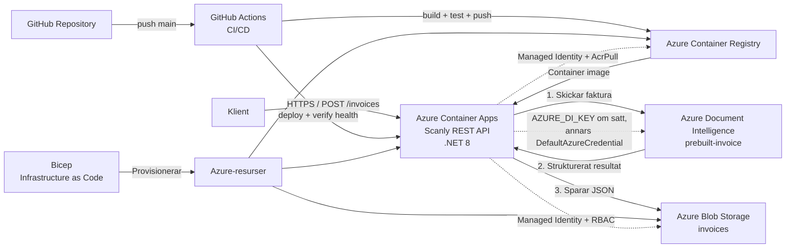

# Scanly AB – Lösningsarkitektur

## 1. Översikt

Scanly AB är en molnbaserad lösning för automatisk behandling av fakturor. Lösningen består av ett .NET 8 REST API som körs i Azure Container Apps. En klient laddar upp en faktura som PDF eller bild till API:t, som skickar dokumentet till Azure Document Intelligence med modellen `prebuilt-invoice` och omvandlar resultatet till ett strukturerat fakturaformat.

Det strukturerade resultatet sparas som JSON i Azure Blob Storage. Docker-images lagras i Azure Container Registry (ACR), GitHub Actions hanterar CI/CD och Azure-infrastrukturen beskrivs med Bicep som Infrastructure as Code.

## 2. Arkitekturdiagram

## 3. API och fakturaflöde

Scanly använder ett .NET 8 Minimal API som körs i Azure Container Apps. API:t exponerar Swagger UI på `/swagger` och innehåller följande endpoints:

- `GET /health` – kontrollerar att API:t är tillgängligt.
- `POST /invoices` – tar emot en faktura som PDF eller bild, analyserar den och sparar resultatet.
- `GET /invoices/{id}` – hämtar resultatet för en specifik faktura.
- `GET /invoices` – listar lagrade faktura-ID:n.

### Flöde för en faktura

1. Klienten skickar en PDF eller bild till `POST /invoices`.
2. API:t skapar ett faktura-ID och skickar dokumentet till Azure Document Intelligence.
3. Modellen `prebuilt-invoice` används för att analysera dokumentet.
4. API:t plockar ut bland annat leverantör, totalbelopp, förfallodatum och radposter.
5. Resultatet serialiseras till JSON.
6. JSON-filen sparas i Azure Blob Storage i containern `invoices`.
7. API:t returnerar HTTP `201 Created` med fakturans ID och status.
8. Resultatet kan därefter hämtas via `GET /invoices/{id}`.

## 4. Azure-resurser

### Azure Container Apps

Scanly API körs i Azure Container Apps med extern ingress på port 8080. Applikationen är konfigurerad med 1 vCPU och 2 GiB minne per replik. Bicep-konfigurationen anger minst 2 repliker och högst 5 repliker. HTTP-baserad autoskalning används med ett tröskelvärde på 10 samtidiga requests.

### Azure Container Registry

Azure Container Registry används som privat register för Scanlys Docker-images. GitHub Actions bygger imagen och pushar både en SHA-baserad tagg och `latest`. Container Appens System Assigned Managed Identity har rollen `AcrPull`, vilket gör att Container Apps kan hämta images från ACR utan hårdkodade registry-credentials.

### Azure Blob Storage

Azure Blob Storage används för att lagra ett strukturerat JSON-resultat per faktura-ID i den privata containern `invoices`. Storage Account använder `Standard_LRS` och Hot access tier. Container Appens Managed Identity har rollen `Storage Blob Data Contributor` och används av applikationen via `DefaultAzureCredential`.

### Azure Document Intelligence

Azure Document Intelligence används för fakturaanalys med modellen `prebuilt-invoice`. I nuvarande implementation läser API:t `AZURE_DI_ENDPOINT` och använder `AZURE_DI_KEY` om den variabeln finns; annars används `DefaultAzureCredential`. Detta gör att implementationen kan fungera både med en delad kursresurs som kräver API-key och med Managed Identity när resurs och identitet finns i en kompatibel tenant.

För kursens delade Document Intelligence-resurs har tenant-begränsningen varit ett praktiskt hinder för Managed Identity. API-key ska därför, när den används, ligga i en säker Azure-konfiguration och aldrig i källkod eller Git-historik. Ett långsiktigt produktionsmål är att använda Managed Identity även mot Document Intelligence när resursen ligger i rätt tenant och RBAC kan konfigureras.

## 5. Infrastructure as Code

Azure-infrastrukturen beskrivs i `infrastructure/main.bicep`. Mallen definierar bland annat Storage Account, privat Blob-container, ACR, Container Apps Environment, Container App, System Assigned Managed Identity, RBAC-rolltilldelningar och autoskalning.

Mallen har parametrar för Storage Account-namn, ACR-namn och Document Intelligence-endpoint. Det finns även dev- och prod-parameterfiler. I nuvarande `main` innehåller parameterfilerna resursnamnen för respektive miljö; Document Intelligence-endpointen behöver därför tillföras vid deployment eller kompletteras i parameterfilen innan en fullständig parameterstyrd deployment.

Bicep-filerna har validerats med Azure CLI och `az deployment group what-if` har använts för att kontrollera planerade förändringar före deployment.

## 6. Säkerhet och identitet

Container Appen använder en System Assigned Managed Identity. Identiteten används för åtkomst till ACR och Blob Storage genom RBAC i stället för lagrade användarnamn, lösenord eller Storage Account Keys.

GitHub Actions autentiserar mot Azure med OIDC och federerad identitet. Workflowet använder `AZURE_CLIENT_ID`, `AZURE_TENANT_ID` och `AZURE_SUBSCRIPTION_ID` från GitHub Secrets, men behöver ingen långlivad client secret.

Document Intelligence hanteras separat eftersom den delade kursresursen ligger i en annan tenant. Om `AZURE_DI_KEY` används ska den behandlas som en hemlighet. Om en hemlig nyckel av misstag hamnar i Git-historiken räcker det inte att ta bort den i en ny commit: nyckeln ska omedelbart roteras eller spärras, och historiken ska saneras vid behov.

## 7. CI/CD och deployment

Projektet använder GitHub Actions för att automatisera build, test och deployment. Workflowet triggas automatiskt vid push till `main`.

### Deploymentflöde

1. Koden checkas ut från GitHub.
2. .NET 8 installeras.
3. `dotnet restore` körs.
4. `dotnet build` körs.
5. xUnit-testprojektet `Scanly.Tests` körs.
6. GitHub Actions loggar in mot Azure med OIDC.
7. Docker-imagen byggs och taggas med Git commit SHA samt `latest`.
8. Imagen pushas till Azure Container Registry.
9. Azure Container Apps uppdateras med den SHA-taggade imagen.
10. Workflowet hämtar Container Appens publika FQDN och anropar `/health`.

Om restore, build eller test misslyckas stoppas workflowet och någon ny version deployas inte. En deployment betraktas som verifierad först när den publika health-kontrollen lyckas. En verifierad körning har returnerat `{"status":"ok","mode":"azure"}`.

### Rollback

Azure Container Apps revisionsfunktion har testats för rollback. En tidigare fungerande revision användes som källa till en rollback-revision, och den återställda revisionen fick 100 procent av trafiken. Därefter verifierades API:t på nytt via `/health`.

## 8. Teknisk reflektion och designval

### 8.1 Varför Container Apps och inte AKS?

Container Apps passar Scanly eftersom lösningen består av ett containeriserat API som behöver ingress, revisionshantering och autoskalning utan att teamet samtidigt behöver administrera ett Kubernetes-kluster. Det ger mindre operativ komplexitet och är rimligt för ett mindre SaaS-system med en begränsad mängd tjänster. Nackdelen är att teamet får mindre direkt kontroll över noder, nätverk och Kubernetes-resurser än i AKS. AKS skulle bli mer relevant om Scanly utvecklas till många mikrotjänster med mer avancerade nätverkskrav, service mesh, specialiserade workloads eller behov av detaljerad klusterstyrning. För den nuvarande lösningen skulle den extra driftbördan i AKS inte ge tillräcklig nytta.

### 8.2 CI/CD – från git push till live app

En push till `main` triggar GitHub Actions automatiskt. Pipelineflödet genomför restore, build och xUnit-test innan någon Docker-image får publiceras. Efter godkänt test autentiserar workflowet mot Azure med OIDC, bygger imagen, pushar den till ACR och deployar den till Container Apps. Sist anropas den publika `/health`-endpointen för att verifiera att den nya versionen faktiskt är live. Om ett tidigt steg misslyckas stoppas kedjan och den befintliga live-versionen påverkas inte av en ny deployment.

### 8.3 Varför Bicep och vad betyder idempotens?

Bicep används för att göra infrastrukturen reproducerbar, versionshanterad och möjlig att granska tillsammans med applikationskoden. I stället för att manuellt klicka fram varje resurs beskriver mallen vilket slutläge Azure-miljön ska ha. Idempotens innebär att samma deklarativa konfiguration kan köras flera gånger och fortfarande sträva efter samma slutläge i stället för att skapa nya dubbletter varje gång. Det minskar risken för konfigurationsskillnader mellan miljöer och gör ändringar lättare att granska innan de genomförs. What-if används som ytterligare kontroll för att se vilka resurser som kommer att ändras.

### 8.4 Säkerhet och credentials

Managed Identity och RBAC används för ACR och Blob Storage så att applikationen inte behöver lagra dessa tjänsters credentials. GitHub Actions använder OIDC i stället för en långlivad client secret. För Document Intelligence kan den nuvarande implementationen använda API-key när den delade kursresursens tenant gör Managed Identity opraktiskt; nyckeln ska då ligga utanför källkoden och hanteras som en secret. Om en credential råkar committas ska den betraktas som komprometterad och roteras omedelbart även om commiten senare tas bort. Därefter bör Git-historiken saneras vid behov och åtkomstloggar kontrolleras.

## 9. Ekonomi

Kostnadsanalysen är gjord i Azure Pricing Calculator med region Sweden Central och SEK som valuta. Beräkningen använder Scanlys scenario med 30 kunder och cirka 15 000 fakturor per månad vid lansering. Antagandet är i genomsnitt en analyserad sida per faktura.

### 9.1 Lansering – 30 kunder / cirka 15 000 fakturor per månad

| Resurs | Antagande | Månadskostnad |
|---|---|---:|
| Azure Container Apps | Consumption, 2 min-repliker, 1 vCPU och 2 GiB per replik | 450,30 kr |
| Azure Container Registry | Basic, 1 register | 47,58 kr |
| Azure Blob Storage | Standard LRS, Hot, cirka 1 GB och uppskattade operationer | 0,99 kr |
| Azure Document Intelligence | S0, prebuilt-invoice, 15 × 1 000 sidor | 1 427,88 kr |
| **Totalt** |  | **1 926,75 kr/mån** |

Beräknad årskostnad är **23 120,96 kr**. Vid 15 000 fakturor per månad blir den uppskattade Azure-kostnaden cirka **0,13 kr per faktura**.

### 9.2 Tredubblad kundbas – 90 kunder / cirka 45 000 fakturor per månad

| Resurs | Antagande | Månadskostnad |
|---|---|---:|
| Azure Container Apps | Samma min-kapacitet; 45 000 requests ligger fortfarande inom kalkylens fria request/aktiva kvot | 450,30 kr |
| Azure Container Registry | Basic, 1 register | 47,58 kr |
| Azure Blob Storage | cirka 3 GB, 45 000 skrivningar och 45 000 läsningar | cirka 2,98 kr |
| Azure Document Intelligence | S0, prebuilt-invoice, 45 × 1 000 sidor | 4 283,64 kr |
| **Totalt** |  | **4 784,49 kr/mån** |

Beräknad årskostnad är **57 413,94 kr**. Vid 45 000 fakturor per månad blir kostnaden cirka **0,11 kr per faktura**. Totalkostnaden ökar alltså tydligt när användningen växer, men kostnaden per faktura sjunker eftersom ACR och den konfigurerade Container Apps-grundkapaciteten inte tredubblas i samma takt.

### 9.3 Dyraste resursen

Azure Document Intelligence är den största kostnadsdrivaren. Vid lansering står tjänsten för 1 427,88 kr av totalt 1 926,75 kr per månad, och vid tredubblad kundbas stiger den till 4 283,64 kr per månad. Kostnaden följer antalet analyserade sidor betydligt mer direkt än ACR och den grundkapacitet som hålls igång i Container Apps. Därför är Document Intelligence den viktigaste resursen att följa ur kostnadsperspektiv.

### 9.4 Flaskhals vid fyrdubblad trafik

Vid ungefär fyra gånger lanseringstrafiken skulle Scanly hantera omkring 60 000 fakturor per månad. Container Apps kan skala från 2 till maximalt 5 repliker, vilket sätter ett konfigurerat tak för hur mycket API-lagret kan skala ut utan en ändring i infrastrukturen. Samtidigt väntar `POST /invoices` synkront på Document Intelligence innan requesten slutförs, vilket gör AI-tjänstens svarstid, genomströmning och eventuella quota viktiga vid trafiktoppar. Den första praktiska flaskhalsen kan därför uppstå i kombinationen Document Intelligence och det synkrona requestflödet snarare än i Blob Storage. Vid fortsatt tillväxt bör lösningen belastningstestas och vid behov utvecklas mot asynkron fakturabehandling med kö, tillsammans med justerad `maxReplicas` och övervakning.

## 10. Begränsningar och nästa steg

Den nuvarande lösningen är byggd för kursprojektets omfattning. Full produktionssättning skulle kräva ytterligare arbete med bland annat slutanvändarautentisering, rate limiting, central övervakning och larm, kostnadsbudgetar samt en mer komplett disaster recovery-plan.

Document Intelligence-autentiseringen är dessutom beroende av hur den delade kursresursen är placerad i förhållande till Container Appens tenant. Målet bör vara Managed Identity utan nyckelfallback när rätt Azure-resurs och RBAC kan användas.

Dev/prod-parameterfilerna bör före en helt parameterstyrd deployment även innehålla eller få tillfört det Document Intelligence-endpointvärde som `main.bicep` kräver.
