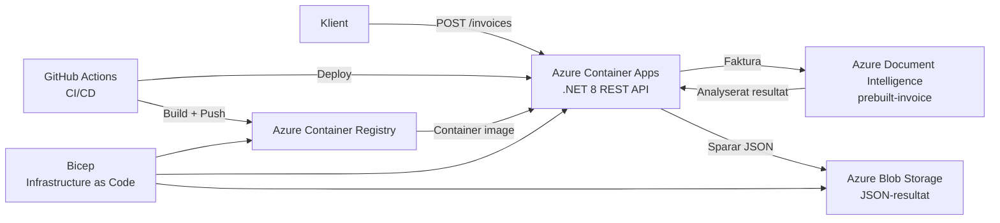

# Teknisk leveransrapport

**Uppdrag:** Scanly AB — Fakturaigenkänning som tjänst  
**Konsultteam:** Victor, Avdija och William  
**Datum:** 2026-10-01  
**Version:** 1.1  

---

## Sammanfattning

Konsultteamet har byggt en molnbaserad lösning för Scanly AB där en kund kan ladda upp en faktura som PDF eller bild via ett REST-API och få ett strukturerat fakturaresultat tillbaka. Lösningen använder Azure Document Intelligence för analys, Azure Blob Storage för resultatlagring och Azure Container Apps för drift. Applikationen är containeriserad med Docker, infrastrukturen definieras med Bicep och leveransflödet automatiseras med GitHub Actions.

Lösningen är uppdelad i tydliga ansvarsområden inom teamet: backend och AI-integration, Azure-infrastruktur samt CI/CD och driftsättning. Gemensamt ansvar omfattar slutlig integration, systemtest, kundrapport, arkitekturbeskrivning och presentation.

---

## Teamets ansvarsfördelning

| Teammedlem | Huvudansvar | Viktiga leverabler |
|---|---|---|
| **Victor** | DevOps, CI/CD, containerisering och driftsättning | Docker, Azure Container Registry, GitHub Actions, xUnit health-test, Container Apps deployment, live health-verifiering och rollback |
| **Avdija** | Azure-infrastruktur och Infrastructure as Code | Bicep, Storage Account, Blob Storage, ACR, Container Apps Environment, Container App, Managed Identity, RBAC, autoskalning samt dev/prod-parametrar |
| **William** | Backend-API och AI-integration | .NET 8 Minimal API, endpoints, Swagger/OpenAPI, Azure Document Intelligence, strukturerad respons, Blob Storage-integration, loggning och felhantering |

---

## Vad som levereras

### Inkluderat i leveransen

| Komponent | Teknisk lösning | Status |
|---|---|---|
| REST API | .NET 8 Minimal API, 4 endpoints | ✅ Levererat |
| API-dokumentation | Swagger UI på `/swagger` | ✅ Levererat |
| Fakturaanalys | Azure Document Intelligence, `prebuilt-invoice` | ✅ Implementerat |
| Strukturerat resultat | Leverantör, totalbelopp, förfallodatum och radposter | ✅ Levererat |
| Fillagring | Azure Blob Storage, privat `invoices`-container | ✅ Levererat |
| Containerisering | Docker, multi-stage build | ✅ Levererat |
| Container Registry | Azure Container Registry, Basic | ✅ Levererat |
| Driftsättning | Azure Container Apps | ✅ Levererat |
| Infrastruktur som kod | Bicep | ✅ Levererat |
| Managed Identity och RBAC | ACR och Blob Storage | ✅ Levererat |
| Autoskalning | 2–5 repliker, HTTP-baserad scaling rule | ✅ Levererat |
| Automatiserad CI/CD | GitHub Actions med Azure OIDC | ✅ Levererat |
| Automatiserat test | xUnit-test av `GET /health` | ✅ Levererat |
| Live health-verifiering | Health check efter deployment | ✅ Verifierat |
| Rollback | Tidigare Container Apps-revision återställd | ✅ Verifierat |

### API-endpoints

| Endpoint | Funktion |
|---|---|
| `POST /invoices` | Tar emot PDF eller bild och startar fakturaanalys |
| `GET /invoices/{id}` | Hämtar analysresultatet för en faktura |
| `GET /invoices` | Listar lagrade faktura-ID:n |
| `GET /health` | Verifierar att API:t är tillgängligt |

---

## Arkitektur

### Systemdiagram



### Fakturaflöde

1. Kunden skickar en PDF eller bild till `POST /invoices`.
2. API:t validerar filen och skapar ett unikt faktura-ID.
3. Dokumentet skickas till Azure Document Intelligence.
4. Modellen `prebuilt-invoice` analyserar fakturan.
5. API:t omvandlar analysen till Scanlys strukturerade fakturaformat.
6. Resultatet serialiseras till JSON och sparas i Azure Blob Storage.
7. API:t returnerar HTTP `201 Created` med faktura-ID och status.
8. Resultatet kan hämtas via `GET /invoices/{id}`.

---

## Motiverade arkitekturval

### Azure Container Apps

Azure Container Apps valdes eftersom Scanly består av en containeriserad API-tjänst som behöver ingress, revisionshantering och autoskalning utan att teamet behöver drifta ett fullständigt Kubernetes-kluster. Detta minskar den operativa komplexiteten jämfört med AKS. AKS skulle vara mer relevant om lösningen utvecklades till många mikrotjänster med mer avancerade nätverks-, kluster- eller orkestreringskrav.

### Bicep

Bicep används för att beskriva Azure-infrastrukturen som kod. Det ger versionshantering, reproducerbarhet och möjlighet att granska förändringar innan deployment. `az deployment group what-if` används för att kontrollera vilka förändringar en deployment skulle orsaka.

### Azure Blob Storage

Fakturaresultaten lagras som JSON och lämpar sig väl för Blob Storage. Tjänsten är kostnadseffektiv för denna typ av objektlagring och kan användas med Managed Identity och RBAC utan att Storage Account Keys behöver lagras i applikationen.

---

## Azure-infrastruktur

Avdijas infrastrukturarbete definierar och konfigurerar lösningens centrala Azure-resurser:

- Azure Storage Account med `Standard_LRS` och Hot access tier.
- Privat Blob Storage-container med namnet `invoices`.
- Azure Container Registry med Basic-SKU.
- Azure Container Apps Environment.
- Azure Container App med System Assigned Managed Identity.
- Extern ingress på port 8080.
- 1 vCPU och 2 GiB minne per replik.
- Minst 2 och maximalt 5 repliker.
- HTTP-baserad autoskalning vid 10 samtidiga requests.
- `AcrPull` för Container Appens Managed Identity.
- `Storage Blob Data Contributor` för Blob Storage.
- Separata parameterfiler för dev och prod.

Infrastrukturen definieras i `infrastructure/main.bicep`.

---

## Backend och AI-integration

Williams ansvarsområde omfattar applikationslogiken och integrationen mot Azure Document Intelligence.

API:t är byggt som ett .NET 8 Minimal API med Swagger/OpenAPI. `POST /invoices` tar emot en fil, anropar modellen `prebuilt-invoice` och parsar bland annat:

- `VendorName`
- `InvoiceTotal`
- `DueDate`
- `Items`
- beskrivning
- antal
- enhetspris
- radbelopp

Resultatet lagras i ett eget fakturaformat och sparas som JSON i Blob Storage.

### Felhantering och loggning

API:t kontrollerar att en uppladdad fil finns och inte är tom. Azure-relaterade fel fångas som `RequestFailedException`, loggas tillsammans med statuskod och returneras som ett tydligt Problem Details-svar. Oväntade fel loggas separat och returnerar HTTP 500.

Loggning sker bland annat när:

- en faktura börjar behandlas,
- Document Intelligence-analysen startar,
- analysen slutförs,
- JSON-resultatet sparas i Blob Storage.

---

## CI/CD, test och driftsättning

Victors ansvarsområde omfattar leveransflödet från Git till verifierad live-applikation.

CI/CD-flödet finns i:

```text
.github/workflows/deploy.yml
```

Workflowet triggas vid push till `main` och kör:

```text
git push main
      ↓
Checkout
      ↓
Setup .NET 8
      ↓
Restore
      ↓
Build
      ↓
xUnit-test
      ↓
Azure-login via OIDC
      ↓
Login till ACR
      ↓
Docker build
      ↓
Tagg med Git commit SHA + latest
      ↓
Push till ACR
      ↓
Deploy till Azure Container Apps
      ↓
GET /health
```

Testprojektet `Scanly.Tests` använder `WebApplicationFactory<Program>` och verifierar att `GET /health` returnerar HTTP 200 innan deployment får fortsätta.

GitHub Actions autentiserar mot Azure med OIDC och federerad identitet. Därmed behövs ingen långlivad client secret i workflowet.

Efter deployment hämtas Container Appens publika FQDN och `/health` anropas. En verifierad körning har returnerat:

```json
{"status":"ok","mode":"azure"}
```

---

## Säkerhetsarkitektur

### Identitet och åtkomst

| Resurs | Åtkomstkontroll |
|---|---|
| Azure Container App | System Assigned Managed Identity |
| Azure Container Registry | `AcrPull` via Managed Identity |
| Azure Blob Storage | `Storage Blob Data Contributor` via Managed Identity |
| GitHub Actions → Azure | OIDC / federerad identitet |
| Azure Document Intelligence | `AZURE_DI_KEY` om konfigurerad, annars `DefaultAzureCredential` |

### Hemlighetshantering

Inga Azure-lösenord eller långlivade client secrets ligger i GitHub Actions-workflowet. OIDC används för GitHub Actions mot Azure.

Den delade kursresursen för Document Intelligence ligger i en annan tenant. Applikationen stödjer därför en API-key via miljövariabeln `AZURE_DI_KEY` när det behövs. Nyckeln ska hanteras som en Azure-secret och aldrig hårdkodas i källkoden eller läggas i Git-historiken.

### Kvarvarande risker

| Risk | Prioritet | Rekommenderad åtgärd |
|---|---|---|
| API saknar slutanvändarautentisering | Hög | Inför Entra ID/Easy Auth eller motsvarande |
| Ingen rate limiting | Medel | Inför throttling eller API Management |
| Document Intelligence kan behöva API-key p.g.a. tenantgräns | Medel | Flytta till rätt tenant och använd Managed Identity när möjligt |
| Begränsad central övervakning | Medel | Koppla Application Insights och alerts |
| Max 5 Container Apps-repliker | Medel | Belastningstesta och höj gränsen vid behov |

---

## Rollback och revisionshantering

Azure Container Apps revisionsfunktion har verifierats genom rollback till en tidigare fungerande version.

Exempel på genomförd rollback:

```powershell
az containerapp revision copy `
  --name scanly-api `
  --resource-group "RG-Avdija-Mahmutovic-a632c3-DotNetCloudDeveloper-VT-Mars-Goteborg" `
  --from-revision scanly-api--utrknay `
  --revision-suffix rollback
```

Den nya rollback-revisionen `scanly-api--rollback` fick 100 procent av trafiken och API:t verifierades därefter via `/health`.

Detta visar att teamet kan återgå till en tidigare fungerande containerrevision om en ny deployment orsakar problem.

---

## Kostnadskalkyl

Kalkylen är gjord i Azure Pricing Calculator med region **Sweden Central** och SEK som valuta.

### Lansering — 30 kunder / cirka 15 000 fakturor per månad

| Resurs | Konfiguration | Kostnad/mån |
|---|---|---:|
| Azure Container Apps | Consumption, 2 min-repliker, 1 vCPU / 2 GiB | 450,30 kr |
| Azure Container Registry | Basic | 47,58 kr |
| Azure Blob Storage | Standard LRS, Hot, cirka 1 GB | 0,99 kr |
| Azure Document Intelligence | S0, `prebuilt-invoice`, 15 000 sidor | 1 427,88 kr |
| **Totalt** |  | **1 926,75 kr/mån** |

Beräknad årskostnad:

```text
23 120,96 kr
```

Kostnad per faktura:

```text
1 926,75 / 15 000 ≈ 0,13 kr per faktura
```

Vid ett scenario med 30 kunder och 299 kr per kund är månadsintäkten:

```text
30 × 299 = 8 970 kr/mån
```

Azure-infrastrukturen motsvarar därmed ungefär 21,5 procent av scenariointäkten före övriga företagskostnader.

### Tredubblad kundbas — 90 kunder / cirka 45 000 fakturor per månad

| Resurs | Kostnad/mån |
|---|---:|
| Azure Container Apps | 450,30 kr |
| Azure Container Registry | 47,58 kr |
| Azure Blob Storage | cirka 2,98 kr |
| Azure Document Intelligence | 4 283,64 kr |
| **Totalt** | **4 784,49 kr/mån** |

Beräknad årskostnad:

```text
57 413,94 kr
```

Kostnad per faktura:

```text
4 784,49 / 45 000 ≈ 0,11 kr per faktura
```

Azure Document Intelligence är den tydligaste kostnadsdrivaren. Vid lansering står tjänsten för cirka 74 procent av den beräknade Azure-kostnaden.

---

## Skalning och flaskhals

Container Appen är konfigurerad med:

```text
Min replicas: 2
Max replicas: 5
HTTP scaling rule: 10 concurrent requests
CPU per replica: 1 vCPU
Memory per replica: 2 GiB
```

Vid fyrdubblad lanseringstrafik motsvarar belastningen cirka 60 000 fakturor per månad. API:t kan skala ut till fem repliker, men `POST /invoices` väntar synkront på att Document Intelligence ska slutföra analysen.

Den första praktiska flaskhalsen kan därför uppstå i kombinationen av:

- Document Intelligence-svarstid och genomströmning,
- det synkrona fakturaflödet,
- Container Apps konfigurerade tak på fem repliker.

Vid högre belastning rekommenderas belastningstest, utökad övervakning och på sikt ett asynkront flöde med köbaserad behandling.

---

## Utanför leveransens scope

Följande funktioner ingår inte i den aktuella sprintens leverans:

| Punkt | Motivering |
|---|---|
| Produktionsgodkänd slutanvändarautentisering | Kräver definierad användar- och behörighetsmodell |
| Rate limiting / API Management | Bör införas före bred extern användning |
| Full disaster recovery-plan | Rollback är verifierad, men regional DR ingår inte |
| Full Application Insights-observability | API-loggning finns, men komplett dashboard/alerting bör läggas till |
| Asynkron köbaserad fakturabehandling | Nuvarande implementation behandlar analysen synkront |

---

## Rekommendationer inför produktionssättning

1. **Inför slutanvändarautentisering** — skydda API:t med Entra ID/Easy Auth eller motsvarande.
2. **Komplettera övervakningen** — anslut Application Insights och konfigurera alerts för fel och hög svarstid.
3. **Inför rate limiting** — skydda fakturaendpointen mot överbelastning och missbruk.
4. **Sätt kostnadsbudget och larm** — använd Azure Cost Management för att upptäcka kostnadsökningar tidigt.
5. **Belastningstesta fakturaflödet** — verifiera Document Intelligence och Container Apps under hög samtidighet.
6. **Överväg asynkron behandling** — inför kö om svarstider eller trafiktoppar blir ett problem.
7. **Använd Managed Identity fullt ut där tenantstrukturen tillåter det** — minimera behovet av nycklar.
8. **Testa rollback regelbundet** — behandla rollback som en del av den normala driftrutinen.

---

## Överlämning

| Leverabel | Plats |
|---|---|
| Källkod | `https://github.com/WhiteHammer11/scanly` |
| Bicep-mall | `/infrastructure/main.bicep` |
| Dev-parametrar | `/infrastructure/dev.bicepparam` |
| Prod-parametrar | `/infrastructure/prod.bicepparam` |
| CI/CD-workflow | `/.github/workflows/deploy.yml` |
| Dockerfile | `/Dockerfile` |
| Arkitekturreflektion | `/ARCHITECTURE.md` |
| Gemensam kundrapport | `/RAPPORT.md` |
| Individuella reflektioner | `/REFLEKTION_[namn].md` |
| API-dokumentation | Container Appens publika URL + `/swagger` |
| Health check | Container Appens publika URL + `/health` |

---

## Leveransstatus per ansvarsområde

### Victor — DevOps, CI/CD och driftsättning

Verifierat:

- Docker multi-stage build.
- Image-publicering till ACR.
- GitHub Actions-pipeline.
- Azure OIDC.
- Automatiserat xUnit health-test.
- Deployment till Container Apps.
- Live `/health` efter deployment.
- Revisioner och rollback.

### Avdija — Azure-infrastruktur och IaC

Levererat:

- Bicep-baserad Azure-infrastruktur.
- Storage Account och Blob-container.
- Azure Container Registry.
- Container Apps Environment och Container App.
- System Assigned Managed Identity.
- RBAC för ACR och Blob Storage.
- HTTP-baserad autoskalning.
- Dev/prod-parameterfiler.
- What-if-validering.

### William — Backend och AI-integration

Levererat:

- .NET 8 Minimal API.
- Fyra API-endpoints.
- Swagger/OpenAPI.
- Document Intelligence `prebuilt-invoice`.
- Parsning av strukturerat fakturaresultat.
- Radposter.
- Blob Storage-integration.
- Felhantering och loggning.
- Autentiseringsstöd via `DefaultAzureCredential` och API-key vid behov.

---

*Rapporten är upprättad gemensamt av Victor, Avdija och William som avslutande tekniskt leveransdokument för Scanly AB.*
